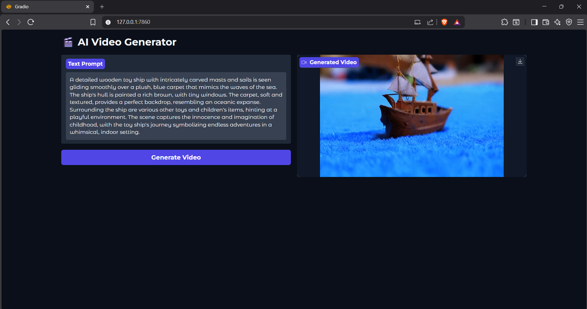

# 🎬 AI Video Generator: Local CogVideoX-2B

A lightweight, locally-hosted **Text-to-Video generation interface** powered by [THUDM/CogVideoX-2b](https://huggingface.co/THUDM/CogVideoX-2b).

This project is specifically engineered to bring high-end AI video rendering to consumer-grade hardware. By implementing advanced memory optimizations such as **Sequential CPU Offloading**, **VAE Slicing**, and **VAE Tiling**, the application enables massive **14GB video models** to run on GPUs with as little as **6GB VRAM**.

---

# ⚡ Features

* **Zero-Cloud Dependency**
  Run cinematic AI video generation entirely offline on your local machine.

* **Consumer GPU Optimized**
  Pipeline architecture specifically designed for low-VRAM GPUs.

* **Gradio Web Interface**
  Clean and responsive browser-based UI for prompt-to-video generation.

* **Automated Cleanup System**
  Prevents cache overflow and unnecessary storage bloat.

* **Secure Credential Management**
  Uses `python-dotenv` to safely manage Hugging Face credentials.

---

# 🛠️ Prerequisites

> ⚠️ This model is extremely hardware-intensive.

## Hardware Requirements

| Component      | Requirement                                                           |
| -------------- | --------------------------------------------------------------------- |
| GPU            | NVIDIA GPU with **6GB VRAM minimum** (RTX 3050 or better recommended) |
| RAM            | Minimum **16GB System RAM**                                           |
| Storage        | At least **40GB free SSD space**                                      |
| Virtual Memory | **40GB Windows Pagefile** strongly recommended                        |

### Important Note for 6GB GPUs

You **must** configure a **40GB Pagefile** in Windows to prevent CUDA Out-Of-Memory crashes during model initialization.

---

## Software Requirements

| Software | Version                  |
| -------- | ------------------------ |
| OS       | Windows 10 / 11 (64-bit) |
| Python   | **3.10** or **3.11**     |
| Git      | Latest Version           |

> ❌ Avoid Python 3.12+ because PyTorch CUDA binaries may not be fully compatible.

---

# ⚙️ Installation & Setup

## 1. Clone the Repository

```bash
git clone https://github.com/balafromtn/AI-Text-2-Video-Generator.git
cd ai-video-generator
```

---

## 2. Create and Activate a Virtual Environment

```bash
python -m venv venv
```

### Activate the Environment (Windows)

```bash
venv\Scripts\activate
```

---

## 3. Install PyTorch with CUDA Support

Install GPU-enabled PyTorch before other dependencies.

```bash
pip install torch torchvision torchaudio --index-url https://download.pytorch.org/whl/cu121
```

---

## 4. Install Project Dependencies

```bash
pip install -r requirements.txt
```

---

## 5. Configure Environment Variables

Create a `.env` file in the project root directory:

```env
HF_TOKEN="hf_YOUR_HUGGING_FACE_TOKEN"
HF_HOME="./model"
```

> Ensure you have accepted the model terms on the Hugging Face CogVideoX-2b page before generating a token.

---

# 🚀 Usage

Start the application:

```bash
python app.py
```

---

## First Run

The application will automatically download approximately **13.8GB** of model weights into:

```plaintext
./model
```

---

## Subsequent Runs

After the initial download, the application will use locally cached model files for faster startup.

---

# 🌐 Access the Interface

Open the following URL in your browser:

```plaintext
http://127.0.0.1:7860
```

---

# 🏗️ Architecture & Workflow

This application is designed to pipeline massive AI models through limited hardware resources.

---

## 🔹 Prompt Input

User prompts are received through the Gradio web interface.

---

## 🔹 Tokenization

Input text is processed using:

* `sentencepiece`
* `tiktoken`

---

## 🔹 Text Encoding

The T5-XXL text encoder converts prompts into semantic embeddings.

---

## 🔹 Sequential CPU Offloading

```python
enable_sequential_cpu_offload()
```

Instead of loading the entire 14GB model into VRAM, the pipeline dynamically streams layers between:

* System RAM
* GPU VRAM

This optimization enables the model to function on low-memory GPUs.

---

## 🔹 Video Generation

The transformer generates:

* 49 frames
* Approximately 6 seconds of video
* 8 FPS output
* Average local generation latency: **~7 minutes** *(varies depending on GPU, RAM, and system load)*

---

## 🔹 VAE Decoding

```python
enable_slicing()
enable_tiling()
```

Frames are decoded in isolated chunks to prevent VRAM spikes during final rendering.

---

## 🔹 Export

Generated frames are compiled into `.mp4` videos using:

* `decord`
* `imageio`

Videos are saved inside:

```plaintext
./generated_videos
```

---

# 📁 Folder Structure

```plaintext
AI_T2V/
│
├── model/                  # Local model weights (Git ignored)
├── generated_videos/       # Generated .mp4 outputs
├── sample/                 # Demo assets
├── venv/                   # Python virtual environment
│
├── .env                    # Environment variables (Git ignored)
├── .gitignore
├── app.py                  # Main application logic
├── requirements.txt
└── README.md
```

---

# 🎥 Gallery

## Example Prompt

> A detailed wooden toy ship with intricately carved masts and sails glides smoothly across a plush blue carpet resembling ocean waves. The ship's rich brown hull contains tiny windows while surrounding toys create a whimsical indoor adventure scene filled with childhood imagination.

---

## Sample Output

```html
<video src="./sample/sample_output.mp4" width="100%" controls autoplay loop></video>
```

---

## User Interface



---

# 🤝 Contributing

Whether you're:

a frontend developer improving the UI
an ML engineer optimizing inference
or a Python developer improving stability

feel free to contribute.

---

## Contribution Steps

1. Fork the repository

2. Create a feature branch

```bash
git checkout -b feature/AmazingFeature
```

3. Commit your changes

```bash
git commit -m "Add AmazingFeature"
```

4. Push to GitHub

```bash
git push origin feature/AmazingFeature
```

5. Open a Pull Request

---

## Contribution Guidelines

Please ensure:

* New dependencies are added to `requirements.txt`
* Low-VRAM compatibility is maintained
* Large model files remain excluded from Git tracking

---

# 📄 License

This project is licensed under the **MIT License**.

See the `LICENSE` file for more details.

---

# Acknowledgements

Built with:

* Python
* PyTorch
* Diffusers
* Gradio
* Hugging Face

and a lot of persistence.

---
